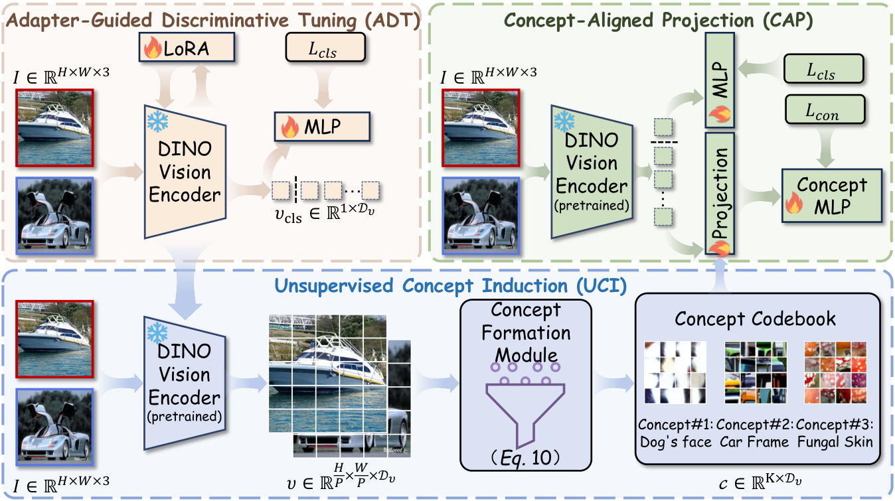
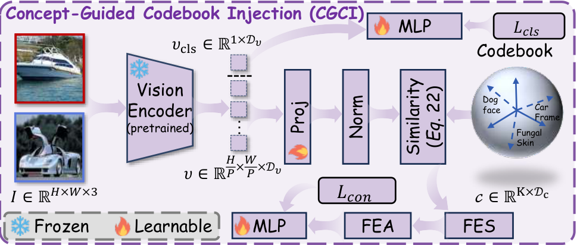
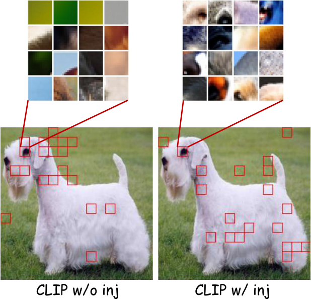

<div align="center">

<h1>🎉 ForensicConcept (ICML 2026)</h1>
<h3>Transferable Forensic Concepts for AIGI Detection</h3>

Menyanshu Zhou<sup>1*</sup>, Ziyin Zhou<sup>1*</sup>, Ke Sun<sup>1</sup>, Yunpeng Luo<sup>1</sup>,<br/>
Jiayi Ji<sup>1</sup>, Xiaoshuai Sun<sup>1,2†</sup>, Rongrong Ji<sup>1</sup>

<sup>1</sup>Key Laboratory of Multimedia Trusted Perception and Efficient Computing,<br/>
Ministry of Education of China, School of Informatics, Xiamen University<br/>
<sup>2</sup>Sino-Russian Research Center for Digital Economy<br/>
<sup>*</sup>Equal contribution &nbsp;&nbsp; <sup>†</sup>Corresponding author

[[`GitHub`](https://github.com/EthanAdamm/FORENSICCONCEPT)]
[[`Paper`](https://arxiv.org/abs/2606.07034)]
[[`Models`](https://huggingface.co/ethan225/ForensicConcept)]
[[`BibTeX`](#citation)]

[](LICENSE)
[](https://www.python.org/)

</div>

---

## 💡 Abstract

> *AI-generated image detectors achieve high accuracy on in-distribution data
> but often fail on unseen generators. A key obstacle to understanding this
> failure is the black-box nature of current detectors: they do not reveal
> which evidence drives their decisions. We propose ForensicConcept, a
> framework that extracts explicit forensic concepts from detectors and
> enables their transfer across backbones. Our method localizes
> decision-critical patches via Transformer attribution, clusters them into a
> compact concept codebook, and uses a concept-aligned projection to produce
> auditable evidence readouts. We introduce a generation-trace reference based
> on CleanDIFT diffusion features, quantify backbone-trace alignment via CKNNA,
> and transfer diffusion-derived concepts through concept codebook injection.
> Experiments on GenImage, GAN-family, and Chameleon show consistent
> improvements under generator and distribution shifts.*

<div align="center">
  
</div>

## ✨ Highlights

- **Auditable forensic concepts.** ForensicConcept converts diffuse detector
  evidence into a compact codebook of visual concepts.
- **Cross-backbone transfer.** Concept-guided codebook injection (CGCI)
  transfers generation traces to target detector backbones.
- **Alignment explains transfer.** CKNNA measures neighborhood consistency
  between detector evidence and CleanDIFT diffusion features.
- **Compact release.** DINOv3 and CLIP detector checkpoints total only 76 MiB
  and are hosted on Hugging Face.

<div align="center">
  
</div>

## 📋 Table of Contents

1. [News](#news)
2. [Installation](#installation)
3. [Model Zoo](#model-zoo)
4. [Dataset Preparation](#dataset-preparation)
5. [Evaluation](#evaluation)
6. [Training](#training)
7. [Results](#results)
8. [Repository Layout](#repository-layout)
9. [Citation](#citation)
10. [License](#license)
11. [Acknowledgement](#acknowledgement)

## 🔥 News <a name="news"></a>

- **2026-07:** Released training and evaluation code, public configurations,
  compact detector checkpoints, the DINOv3 concept matrix, and the CLIP
  generation-trace codebook.
- **2026:** ForensicConcept was accepted at ICML 2026.

## ⚒️ Installation <a name="installation"></a>

### Environment setup

Python 3.10 or newer is required. Install PyTorch for the CUDA version on your
machine, then install the remaining dependencies:

```bash
git clone https://github.com/EthanAdamm/FORENSICCONCEPT.git
cd FORENSICCONCEPT

conda create -n forensicconcept python=3.10 -y
conda activate forensicconcept
python -m pip install -r requirements.txt
```

### DINOv3 dependency

DINOv3 is an external dependency. Clone its official repository into the
default location:

```bash
git clone https://github.com/facebookresearch/dinov3.git ./external/dinov3
```

The integration was tested with DINOv3 package version `0.0.1`. To use another
location, update `training.dinov3_repo_path` in the selected configuration.

## 📦 Model Zoo <a name="model-zoo"></a>

Download the ForensicConcept detector weights from
[`ethan225/ForensicConcept`](https://huggingface.co/ethan225/ForensicConcept)
into the repository root:

```bash
hf download ethan225/ForensicConcept \
  --include "weights/**" \
  --local-dir .
```

| Checkpoint | Purpose | Size |
|---|---|---:|
| `dinov3_vitl16_lora_stage1.pth` | DINOv3 ADT / LoRA initialization | 24.3 MiB |
| `dinov3_vitl16_concept_stage2.pth` | DINOv3 ForensicConcept inference | 26.6 MiB |
| `clip_vitl14_lora_stage1.pth` | CLIP LoRA initialization | 4.6 MiB |
| `clip_vitl14_codebook_stage2.pth` | CLIP CGCI inference | 20.5 MiB |
| `dinov3_concept_matrix.npy` | DINOv3 concepts (`200 x 1024`, float32) | 0.8 MiB |

Stage-1 checkpoints are provided for reproducing stage-2 training. For
inference, use the corresponding stage-2 checkpoint. DINOv3 inference also
requires the released concept matrix. The CLIP stage-2 checkpoint contains its
codebook; the same raw codebook is included at
`assets/codebooks/cleandift_codebook.npy` (`200 x 1280`, float32).

The pretrained DINOv3 ViT-L/16 and CLIP ViT-L/14 backbones are distributed by
their respective upstream projects and are not mirrored here. Place all files
as follows:

```text
weights/
|-- backbones/
|   |-- ViT-L-14.pt
|   `-- dinov3-vitl16/
|       `-- model.safetensors
|-- concepts/
|   `-- dinov3_concept_matrix.npy
`-- detectors/
    |-- dinov3_vitl16_lora_stage1.pth
    |-- dinov3_vitl16_concept_stage2.pth
    |-- clip_vitl14_lora_stage1.pth
    `-- clip_vitl14_codebook_stage2.pth
```

## 🗂️ Dataset Preparation <a name="dataset-preparation"></a>

Images are discovered recursively. Use one of the supported binary class
layouts, preferably `0_real/1_fake`:

```text
datasets/
|-- train/
|   |-- 0_real/
|   `-- 1_fake/
|-- val/
|   |-- 0_real/
|   `-- 1_fake/
`-- test/
    `-- ADM/
        |-- 0_real/
        `-- 1_fake/
```

The loader also recognizes `real/fake`, `raw/synthesis`, and `0_fake/1_real`.
Update `data.*` and `testing.groups` in the selected YAML file for your local
dataset paths. All public configurations use `224 x 224` inputs.

## 🧪 Evaluation <a name="evaluation"></a>

Run commands from the repository root after downloading the detector and
backbone weights.

### DINOv3 ForensicConcept

```bash
python test_with_config.py \
  --config configs/dinov3_concept.yaml \
  --checkpoint_path weights/detectors/dinov3_vitl16_concept_stage2.pth
```

### CLIP with codebook injection

```bash
python test_with_config.py \
  --config configs/clip_codebook.yaml \
  --checkpoint_path weights/detectors/clip_vitl14_codebook_stage2.pth
```

Evaluation reports accuracy, ROC-AUC, and average precision for each dataset
and their mean. DINOv3 reports the main and concept heads at the configured
sparsity ratios. CLIP reports the main classifier and `cb_only` codebook
branch. Evaluation exits with an error if none of the configured dataset paths
can be evaluated.

`clip_cb_tau_w` is a runtime pooling temperature and is not stored in the
checkpoint. The public configuration uses the training default `0.05`.

## 🚀 Training <a name="training"></a>

Both detector families use two stages. Stage 2 initializes from the
corresponding stage-1 checkpoint through `training.epoch`.

### DINOv3

```bash
# Stage 1: adapter-guided discriminative tuning
python train_with_config.py --config configs/dinov3_lora.yaml

# Stage 2: concept-aligned projection
python train_with_config.py --config configs/dinov3_concept.yaml
```

### CLIP

```bash
# Stage 1: visual qkv LoRA and classifier
python train_with_config.py --config configs/clip_lora.yaml

# Stage 2: concept-guided codebook injection
python train_with_config.py --config configs/clip_codebook.yaml
```

Checkpoints and an immutable copy of the effective configuration are written
under `models.checkpoints_dir/training.name`.

### Checkpoint contents

- DINOv3 stage-2 checkpoints contain the classifier, concept mapping/head, and
  all LoRA tensors.
- CLIP stage-2 checkpoints contain visual LoRA, the main classifier, and the
  complete codebook head.
- DINOv3 LoRA loading verifies every adapter key, shape, and tensor value
  before evaluation.

## 📊 Results <a name="results"></a>

All results below are image-level accuracy (%) reported in the paper. The
detector is trained on Stable Diffusion 1.4 images.

| Evaluation benchmark | DINOv3 without concepts | ForensicConcept |
|---|---:|---:|
| GenImage, mean over 8 generators | 90.7 | **92.0** |
| GAN-family, mean over 7 generators | 87.3 | **90.1** |
| Chameleon | 83.7 | **84.4** |
| Mean over the three benchmarks | 87.2 | **88.8** |

The learned codebook also transfers to CLIP ViT-L/14, increasing its GenImage
mean accuracy from **83.7** to **88.2** (+4.5 points). Codebook injection
redirects attention toward more meaningful forensic regions:

<div align="center">
  
</div>

## 🧱 Repository Layout <a name="repository-layout"></a>

```text
.
|-- assets/                 # Released codebook and README figures
|-- configs/                # DINOv3 and CLIP stage configurations
|-- data/                   # Dataset discovery and preprocessing
|-- models/                 # CLIP backbone and codebook head
|-- networks/               # DINOv3 detector and training wrapper
|-- options/                # Runtime options
|-- plugins/                # Optional DINOv3 acceleration plugin
|-- tests/                  # Lightweight release checks
|-- train_with_config.py    # Training entry point
|-- test_with_config.py     # Evaluation entry point
`-- validate.py             # ACC, AUC, and AP evaluation
```

Run the release checks with:

```bash
python -m unittest discover -s tests -v
```

## 🔎 Citation <a name="citation"></a>

If you find this work useful, please cite:

```bibtex
@inproceedings{zhou2026forensicconcept,
  title     = {{ForensicConcept}: Transferable Forensic Concepts for {AIGI} Detection},
  author    = {Zhou, Menyanshu and Zhou, Ziyin and Sun, Ke and Luo, Yunpeng and Ji, Jiayi and Sun, Xiaoshuai and Ji, Rongrong},
  booktitle = {Proceedings of the 43rd International Conference on Machine Learning},
  year      = {2026}
}
```

## 📜 License <a name="license"></a>

ForensicConcept is released under the [Apache License 2.0](LICENSE). External
backbones, model weights, dependencies, and adapted third-party components
remain subject to their respective licenses and terms. See
[`THIRD_PARTY_NOTICES.md`](THIRD_PARTY_NOTICES.md) for details.

## 💗 Acknowledgement <a name="acknowledgement"></a>

This project builds on
[DINOv3](https://github.com/facebookresearch/dinov3),
[OpenAI CLIP](https://github.com/openai/CLIP),
[CleanDIFT](https://github.com/CompVis/cleandift), and
[Microsoft LoRA](https://github.com/microsoft/LoRA). We thank the authors of
these projects and the maintainers of the evaluation benchmarks used in this
work.
